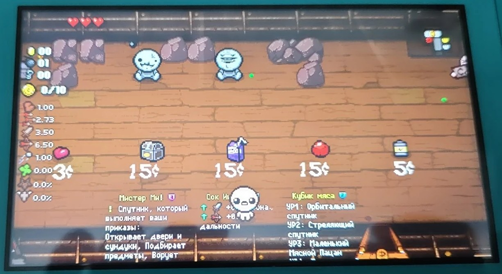
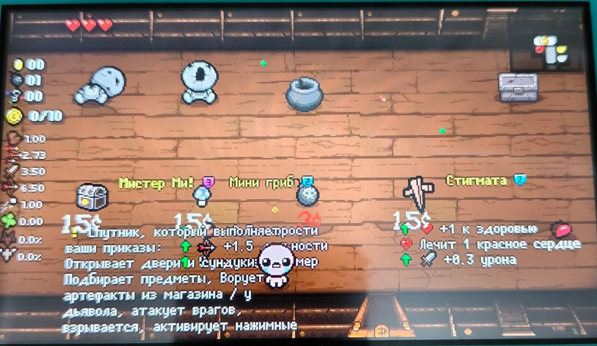
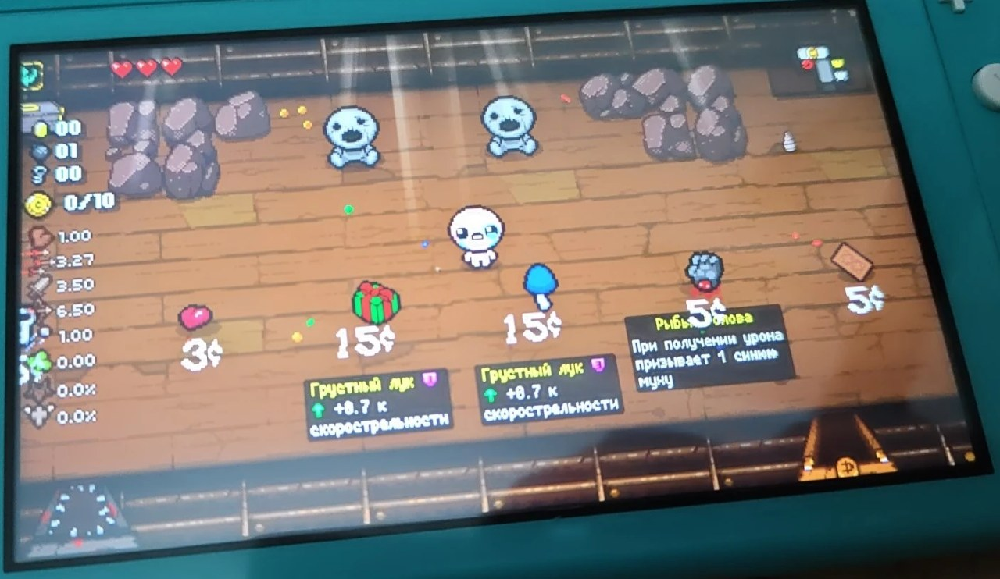
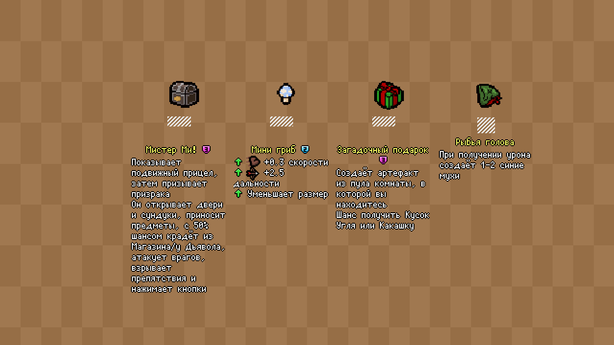

<div align="center">

# Isaac Switch RU EID

**Russian item descriptions with quality badges for _The Binding of Isaac: Repentance_ on a modded Nintendo Switch,
baked straight into the game's item textures — plus a tool that moves your PC Repentance+ progress to the console.**

[](docs/switch-notes.md)
[-8b0000)](docs/switch-notes.md)
[](package.json)
[](package.json)
[](LICENSE)

**English** · [Русский](README.ru.md)



<sub>Real photo of a Switch Lite: every shop item shows its own Russian name, quality badge and description.</sub>

</div>

---

## Why

The Switch port of Repentance cannot run Lua mods, so the famous **External Item Descriptions (EID)** mod is not available there.
A community texture mod, *EID for Switch*, works around that by drawing English descriptions into each item's sprite.
There was no Russian version, and its layout (text to the right of the item, 170 px wide) made shop items overlap on the Switch Lite screen.

This project **renders those textures from scratch**, using EID's own Russian descriptions, its pixel font and its icons:

- **908 sprites** (719 items + 189 trinkets) with Russian text from EID's Repentance tables (not Repentance+, which the console does not run);
- **quality 0–4 badge** next to every item name, which the English mod does not have;
- text **centred under the item** at 75 % scale: each font pixel lands on exactly 2 × 2 screen pixels of the Lite's 720p panel, so it stays crisp;
- blocks are narrow enough that **neighbouring shop items do not overlap**, and they start below altars and price tags;
- HUD icons, the "item held over head" animation and **hidden "?" items** keep working.

It also ships a **save converter**: Repentance+ (PC) → Repentance (Switch), with the save checksum recomputed.

## Features

| | |
|---|---|
| 🎨 **Texture builder** | One command turns EID + the English Switch mod into a ready `atmosphere/` folder |
| 🌍 **Any EID language with Latin/Cyrillic glyphs** | `--lang ru` by default; English fallback per item |
| 🔍 **Preview without a console** | Simulates the Switch Lite screen (shop, pedestal) or shows a sprite's anatomy |
| 📐 **Proven text engine** | `calibrate` re-renders the English mod and diffs it pixel by pixel |
| 💾 **Save converter** | Inspects saves, verifies checksums, converts Repentance+ → Repentance |
| 📦 **Zero dependencies** | Own PNG/PCX codecs, BMFont renderer, Lua table parser and anm2 patcher on plain Node.js |

## How it evolved

| v1: text to the right | v2: separate text layer | v3: one layer, centred |
|:---:|:---:|:---:|
|  |  |  |
| Long descriptions overlap the neighbours and the price tags | Every item read *"The Sad Onion"*: the game swaps sprite sheets **per layer** | Text lives in the item's own layer, centred and scaled to 75 % |

The full story, with the reasoning behind each decision, is in **[docs/how-it-works.md](docs/how-it-works.md)**.

## Quick start

**You need:** a Switch with Atmosphère; *The Binding of Isaac: Afterbirth+* `010021C000B6A000` with update 1.7.9b and the Repentance DLC `010021C000B6B001` (US); [Node.js](https://nodejs.org) 18 or newer.
No game files or third-party assets are included here. The builder reads them from your own copies.

1. **Get the inputs:**
   - **EID**: the mod folder from Steam Workshop (`…/The Binding of Isaac Rebirth/mods/external item descriptions_836319872`) or a copy of [EID on GitHub](https://github.com/wofsauge/External-Item-Descriptions);
   - **EID for Switch (English)** from [GameBanana](https://gamebanana.com/mods/692797), extracted. It provides the item artwork and the `.anm2` files;
   - *optional:* `items_metadata.xml` from [isaac-extended-icons-mod](https://codeberg.org/janAkali/isaac-extended-icons-mod/src/branch/master/utils/parsers/external) for the quality badges.
2. **Configure:** copy `config.example.json` to `config.json` and set the three paths.
3. **Build:**
   ```bash
   npm run build
   ```
   ```text
   Built 908 item sprites + 3 hidden-item sprites + 2 anm2 files
   Language: ru; English fallback: 0; without description: 0; tallest sprite: 424px
   ```
4. **Install:** copy `dist/atmosphere` to the root of the SD card. Mount the card with hekate (*Tools → USB Tools → SD Card*) or a card reader. DBI's MTP mode cannot overwrite files on the SD card, see [switch notes](docs/switch-notes.md).
5. Optional: **preview first:**
   ```bash
   npm run preview -- --scene shop --out shop.png
   ```

<div align="center">

<br><sub>Simulated 1280 × 720 Switch Lite screen (hatched boxes stand in for price tags).</sub>
</div>

## Move your PC progress to the Switch

```bash
node bin/convert-save.js to-repentance rep+persistentgamedata1.dat rep_gamedata1.dat
```

```text
  layout:        repentance
  checksum:      OK
  achievements:  98 / 638
Lost in conversion: the 4 Repentance+-only achievements and 27 Repentance+-only counters.
```

Where the files live, how to put the result on the console and how to go back are covered in **[docs/save-transfer.md](docs/save-transfer.md)**.

## How it was verified

| Check | Result |
|---|---|
| Text engine vs. the original English sprites (`npm run calibrate`) | *The D6*: **0 / 1346** differing pixels; wrap width 165 px reproduces the height of **898 / 908** sprites |
| Refactored code vs. the build deployed on the console | **913 / 913** files byte-identical on the same inputs |
| Save checksum algorithm | Matches **8 real saves**: Afterbirth+, Repentance and Repentance+ from PC, Repentance from Switch |
| Converted save on the console | Written through DBI and read back **byte-identical** |
| Hardware | Switch Lite, Atmosphère, emuMMC, Repentance 1.7.9b |

## Project layout

```text
bin/
  build.js          build the mod (atmosphere/contents/…)
  preview.js        Switch Lite screen simulation, sprite sheets, sprite anatomy
  calibrate.js      diff the text engine against the original English sprites
  convert-save.js   inspect / convert Isaac saves
src/
  png.js pcx.js     image codecs (PNG 8-bit, PCX 4-plane RGBA)
  canvas.js         RGBA canvas, straight-alpha compositing, nearest-neighbour blits
  lua.js            Lua table-constructor parser (reads EID data without running Lua)
  eid-data.js       descriptions, inline icons, item qualities
  bmfont.js         binary BMFont v3 loader and renderer
  anm2.js           Isaac .anm2 reader
  markup.js         EID markup: shortcuts, {{Icons}}, word wrap, line drawing
  layout.js         sprite layouts (final "centred" + classic, for calibration)
  switch-mod.js     title IDs, sprite discovery, anm2 patching, "?" sprite
  isaac-save.js     save format, checksum, Repentance+ → Repentance
  overrides.ru.json console wording for descriptions that mention PC keys
docs/               how it works · save transfer · Switch notes
```

## Limitations

- Textures cannot react to the player. All descriptions are always visible, so very long ones can reach the bottom wall, and the text bobs with the item.
- Translation coverage is EID's. Items EID has not translated fall back to English (0 with EID 5.23).
- Built for the US title IDs. Other regions need their own sprite paths.

## Credits

- **[External Item Descriptions](https://github.com/wofsauge/External-Item-Descriptions)** by Wofsauge & contributors: descriptions, Russian translation, font and icons (read at build time, not redistributed);
- **[EID for Switch](https://gamebanana.com/mods/692797)** by Sporoid: the idea of baking EID into Switch textures, item artwork and anm2 files (read at build time, not redistributed);
- **[isaac-extended-icons-mod](https://codeberg.org/janAkali/isaac-extended-icons-mod)** by janAkali: Switch item metadata (qualities);
- **[isaac-save-edit-script](https://github.com/jamesthejellyfish/isaac-save-edit-script)** by jamesthejellyfish (MIT): save checksum table and algorithm;
- **[Isaac save notes](https://isaac.ardor.guru/guides/repentance-to-repentance-plus/)** on ardor.guru: Repentance ↔ Repentance+ save compatibility.

See [THIRD_PARTY_NOTICES.md](THIRD_PARTY_NOTICES.md).

## Legal

This is an unofficial fan project, not affiliated with or endorsed by Nicalis, Edmund McMillen or Nintendo.
The repository contains only original code and documentation. It ships **no game files, no EID files and no item artwork**:
you build the textures locally from copies you already have. Use it with games you own.
Code: [MIT](LICENSE).
