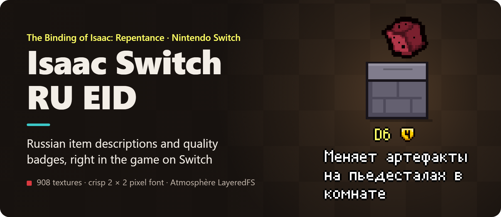
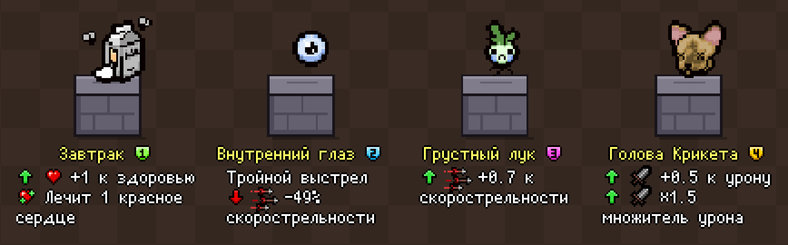
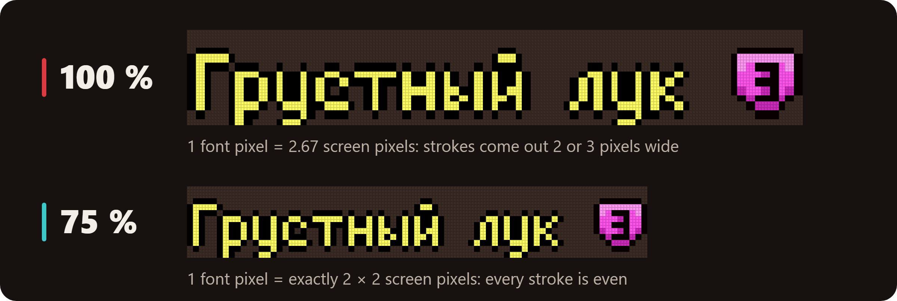
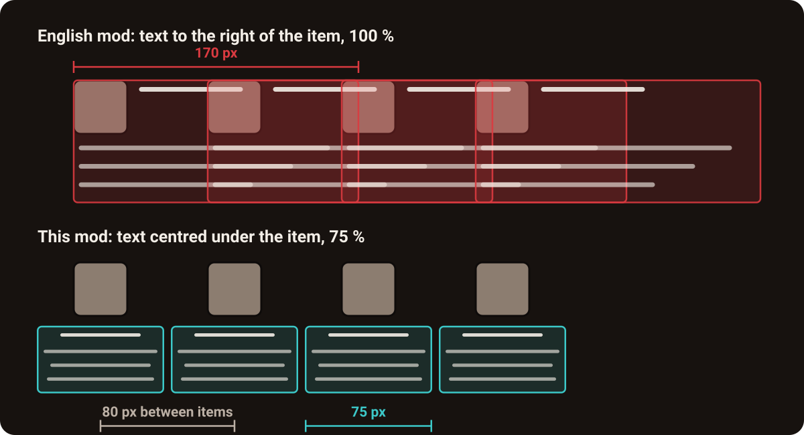
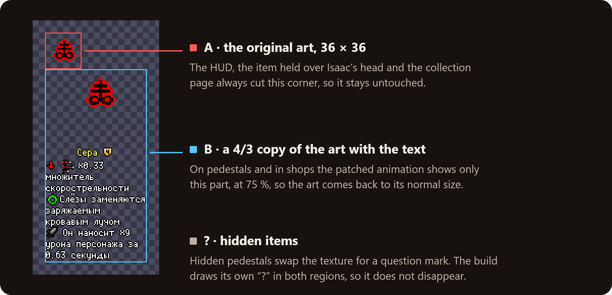

<p align="center">
  
</p>

<p align="center"><b>English</b> · <a href="./README.ru.md">Русский</a></p>

**A texture mod for _The Binding of Isaac: Repentance_ on a modded Nintendo Switch: Russian item descriptions from [External Item Descriptions](https://github.com/wofsauge/External-Item-Descriptions) and quality badges 0–4, right in the game.** Each of the 908 items and trinkets shows its name, quality and what it does, right under it in shops and on pedestals.

<p align="center">
  <a href="#quick-start"><b>Build the mod</b></a> · <a href="#whats-inside">What's inside</a> · <a href="#how-it-is-built">How it is built</a> · <a href="#faq">FAQ</a>
</p>

## The problem

The Switch port of Repentance cannot run Lua mods, so EID, the mod players use to see what an item does, does not work on the console. The texture mod *EID for Switch* draws English descriptions into the item pictures instead. There is no Russian version, and its text sits to the right of each item, 170 pixels wide and at full size. In a shop the descriptions run into each other and into the price tags:

<p align="center">
  
</p>

## What it looks like

<p align="center">
  
</p>

A real Switch Lite with this mod: every item in the shop has its own name, quality badge and description, and they do not touch.

## What's inside

### A description and quality badge under every item

**What it does.** 719 items and 189 trinkets get the name, a quality badge 0–4 and the description from EID's Russian translation, centred under the item. The English mod has no quality badges.

**Why it matters.** You see whether an item is worth taking right in the room, without pausing to look it up.

**How it works.** The Switch cannot run mod code, but Atmosphère can replace game files. So the text is drawn into each item's own texture in advance, and the console shows it as part of the item.

<p align="center">
  
</p>

Rendered by the mod's engine at the Switch Lite's screen resolution. The pedestals are drawn for this picture.

### Crisp text on the Switch Lite screen

**What it does.** The text is shown at 75 %, so every pixel of EID's font becomes exactly 2 × 2 pixels of the screen.

**Why it matters.** Small text stays sharp on the Lite's 5.5-inch screen.

**How it works.** The Lite draws the game's 480 × 270 frame on a 1280 × 720 panel, 2.67 times larger. At 100 % a font pixel turns into 2 or 3 screen pixels, and the letters look uneven. 2.67 × 0.75 = 2, so at 75 % every pixel is the same size.

<p align="center">
  
</p>

### Neighbours in a shop do not overlap

**What it does.** Each description is 75 game pixels wide and centred under its item. Shop items stand about 80 pixels apart, so there is always a gap. The text starts below the pedestal and the price tag.

**Why it matters.** In a shop or a devil room you can read every offer at once.

<p align="center">
  
</p>

### Everything else works as before

**What it does.** The item icon in the HUD, the item Isaac holds over his head, the collection page and hidden “?” items look the same as in the original game.

**How it works.** The texture has two regions. Those parts of the game always cut the top-left corner, so it keeps the original art. Pedestals and shops show only the lower region with the text.

<p align="center">
  
</p>

## Quick start

You build the mod once on a computer; after that it runs on the Switch itself.

**You need:**
- a Switch with Atmosphère;
- *The Binding of Isaac: Afterbirth+* `010021C000B6A000` with update 1.7.9b and the Repentance DLC `010021C000B6B001` (US release);
- [Node.js](https://nodejs.org) 18 or newer.

1. **Get the inputs:**
   - **EID**: a copy of [EID from GitHub](https://github.com/wofsauge/External-Item-Descriptions) or the mod folder from Steam Workshop;
   - **EID for Switch (English)** from [GameBanana](https://gamebanana.com/mods/692797), extracted: the item pictures and `.anm2` files come from it;
   - optional: `items_metadata.xml` from [isaac-extended-icons-mod](https://codeberg.org/janAkali/isaac-extended-icons-mod/src/branch/master/utils/parsers/external) for the quality badges.
2. **Configure:** copy `config.example.json` to `config.json` and set the three paths.
3. **Build** (about 2 seconds):
   ```bash
   npm run build
   ```
   ```text
   Built 908 item sprites + 3 hidden-item sprites + 2 anm2 files
   Language: ru; English fallback: 0; without description: 0; tallest sprite: 424px
   ```
4. **Install:** copy `dist/atmosphere` to the root of the SD card. Connect the card with hekate (*Tools → USB Tools → SD Card*) or a card reader: DBI's MTP mode cannot overwrite files on the card, see the [Switch notes](./docs/switch-notes.md).
5. Optional: **see the result before copying**, without a console:
   ```bash
   npm run preview -- --scene shop --out shop.png
   ```

## How it is built

Plain Node.js with no dependencies: its own PNG and PCX codecs, a BMFont renderer, a Lua table parser and an anm2 patcher. The text engine follows EID's own rules, and `npm run calibrate` checks it against the English mod pixel by pixel. Details: [how it works](./docs/how-it-works.md) and [Switch notes](./docs/switch-notes.md).

## How it was verified

| Check | Result |
|---|---|
| Text engine vs. the English mod's sprites | *The D6*: **0 of 1346** pixels differ; the right height for **898 of 908** sprites |
| Refactored code vs. the build on the console | **913 of 913** files byte-identical on the same inputs |
| Console | Switch Lite, Atmosphère, emuMMC, Repentance 1.7.9b |

## FAQ

**Can I build it in another language?** Yes: `npm run build -- --lang uk_ua` builds Ukrainian with all 908 descriptions translated. EID's pixel font has only Latin and Cyrillic letters, so Chinese, Japanese and Korean will not work.

**Why are all descriptions always on screen?** A texture cannot know where the player stands. Very long descriptions can reach the bottom wall, and the text bobs with the item.

**How do I remove the mod?** Move the folders `010021C000B6A000` and `010021C000B6B001` out of `atmosphere/contents` on the SD card. The game goes back to its own files.

## Credits and license

- [External Item Descriptions](https://github.com/wofsauge/External-Item-Descriptions) by Wofsauge & contributors: descriptions, Russian translation, font and icons.
- [EID for Switch](https://gamebanana.com/mods/692797) by Sporoid: the idea of baking EID into Switch textures, item pictures and anm2 files.
- [isaac-extended-icons-mod](https://codeberg.org/janAkali/isaac-extended-icons-mod) by janAkali: item qualities.

The first two are read from your copies at build time and are not included, see [THIRD_PARTY_NOTICES.md](./THIRD_PARTY_NOTICES.md). An unofficial fan project, not affiliated with Nicalis, Edmund McMillen or Nintendo. There are no game files, EID files or item artwork here, so use it with games you own. Code: [MIT](./LICENSE).
