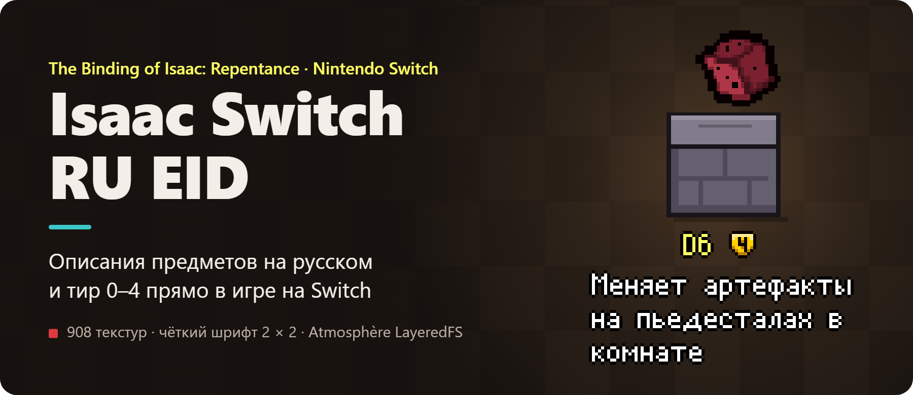
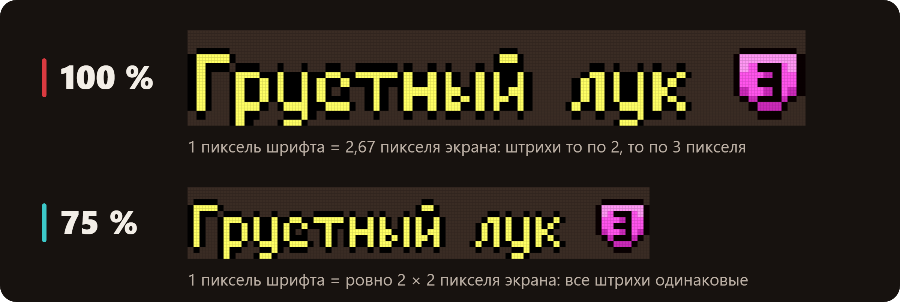
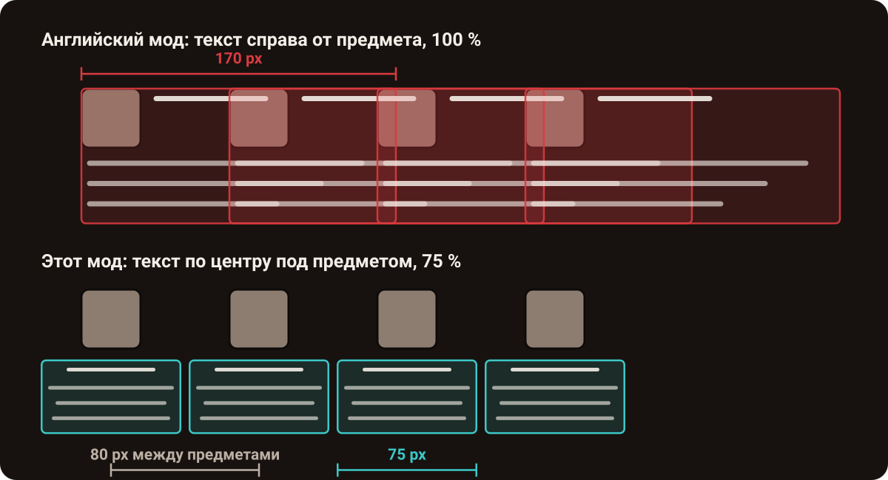
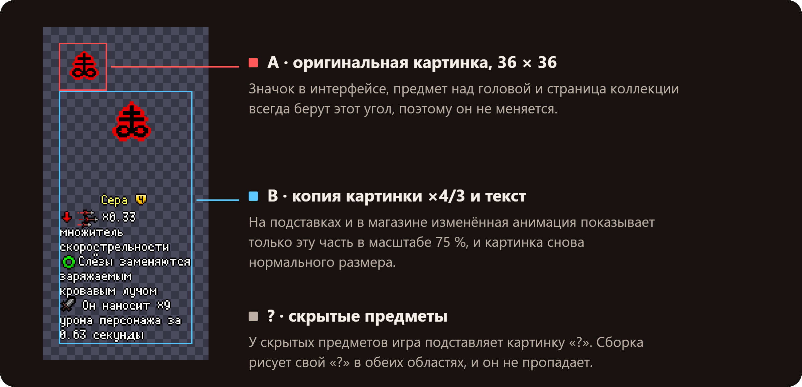

<p align="center">
  
</p>

<p align="center"><a href="./README.md">English</a> · <b>Русский</b></p>

**Текстурный мод для _The Binding of Isaac: Repentance_ на прошитой Nintendo Switch: русские описания предметов из [External Item Descriptions](https://github.com/wofsauge/External-Item-Descriptions) и тир 0–4 прямо в игре.** Под каждым из 908 предметов и брелоков видно название, тир (качество) и что предмет делает, и в магазине, и на подставке.

<p align="center">
  <a href="#быстрый-старт"><b>Собрать мод</b></a> · <a href="#что-внутри">Что внутри</a> · <a href="#как-устроено">Как устроено</a> · <a href="#вопросы-и-ответы">Вопросы</a>
</p>

## Проблема

Версия Repentance для Switch не умеет запускать Lua-моды, поэтому EID, по которому игроки узнают, что делает предмет, на консоли не работает. Вместо него есть текстурный мод *EID for Switch*: он рисует описания прямо в картинках предметов, но только на английском. К тому же его текст стоит справа от предмета, шириной 170 пикселей и в полный размер. В магазине описания налезают друг на друга и на ценники:

<p align="center">
  
</p>

## Как это выглядит

<p align="center">
  
</p>

Настоящая Switch Lite с этим модом: у каждого предмета в магазине своё название, тир и описание, и они не налезают друг на друга.

## Что внутри

### Описание и тир под каждым предметом

**Что делает.** 719 предметов и 189 брелоков получают название, значок тира 0–4 и описание из русского перевода EID, по центру под предметом. В английском моде значков тира нет.

**Зачем тебе.** Сразу видно, стоит ли брать предмет, без паузы и поиска в вики.

**Как устроено.** Запускать код модов Switch не умеет, зато Atmosphère умеет подменять файлы игры. Поэтому текст заранее рисуется в текстуру самого предмета, и консоль показывает его как часть предмета.

<p align="center">
  
</p>

Отрисовано движком мода в разрешении экрана Switch Lite. Подставки нарисованы для иллюстрации.

### Чёткий текст на экране Switch Lite

**Что делает.** Текст показан в масштабе 75 %, и каждый пиксель шрифта EID становится ровно 2 × 2 пикселями экрана.

**Зачем тебе.** Мелкий текст остаётся чётким на 5,5-дюймовом экране Lite.

**Как устроено.** Lite выводит кадр игры 480 × 270 на экран 1280 × 720, то есть увеличивает его в 2,67 раза. В масштабе 100 % пиксель шрифта превращается то в 2, то в 3 пикселя экрана, и буквы выглядят неровными. 2,67 × 0,75 = 2, поэтому в масштабе 75 % все пиксели одинаковые.

<p align="center">
  
</p>

### Соседи в магазине не налезают

**Что делает.** Каждое описание шириной 75 игровых пикселей и стоит по центру под своим предметом. Предметы в магазине стоят примерно через 80 пикселей, поэтому между блоками всегда есть зазор. Текст начинается ниже подставки и ценника.

**Зачем тебе.** В магазине и в комнате дьявола видны сразу все предложения.

<p align="center">
  
</p>

### Всё остальное работает как раньше

**Что делает.** Значок предмета в интерфейсе, предмет над головой Айзека, страница коллекции и скрытые предметы «?» выглядят как в оригинальной игре.

**Как устроено.** В текстуре две области. Эти части игры всегда берут левый верхний угол, поэтому там осталась оригинальная картинка. На подставках и в магазине видна только нижняя область с текстом.

<p align="center">
  
</p>

## Быстрый старт

Мод собирается один раз на компьютере, дальше он работает на самой Switch.

**Что нужно:**
- Switch с Atmosphère;
- *The Binding of Isaac: Afterbirth+* `010021C000B6A000` с обновлением 1.7.9b и DLC Repentance `010021C000B6B001` (американское издание);
- [Node.js](https://nodejs.org) версии 18 или новее.

1. **Скачай исходники:**
   - **EID**: копия [EID с GitHub](https://github.com/wofsauge/External-Item-Descriptions) или папка мода из Steam Workshop;
   - **EID for Switch (English)** с [GameBanana](https://gamebanana.com/mods/692797), распакованный: из него берутся картинки предметов и файлы `.anm2`;
   - по желанию: `items_metadata.xml` из [isaac-extended-icons-mod](https://codeberg.org/janAkali/isaac-extended-icons-mod/src/branch/master/utils/parsers/external), он нужен для значков тира.
2. **Настрой:** скопируй `config.example.json` в `config.json` и пропиши три пути.
3. **Собери** (около 2 секунд):
   ```bash
   npm run build
   ```
   ```text
   Built 908 item sprites + 3 hidden-item sprites + 2 anm2 files
   Language: ru; English fallback: 0; without description: 0; tallest sprite: 424px
   ```
4. **Установи:** скопируй `dist/atmosphere` в корень карты памяти. Карту подключи через hekate (*Tools → USB Tools → SD Card*) или картридер: в режиме MTP программа DBI не перезаписывает файлы на карте, подробнее в [заметках про Switch](./docs/switch-notes.md).
5. По желанию **посмотри результат до копирования**, без консоли:
   ```bash
   npm run preview -- --scene shop --out shop.png
   ```

## Как устроено

Чистый Node.js без зависимостей: свои кодеки PNG и PCX, отрисовка шрифтов BMFont, разбор Lua-таблиц и правка файлов anm2. Текст рисуется по правилам самого EID, а `npm run calibrate` попиксельно сверяет движок с английским модом. Подробно (на английском): [как это работает](./docs/how-it-works.md) и [заметки про Switch](./docs/switch-notes.md).

## Как проверено

| Проверка | Результат |
|---|---|
| Движок текста против картинок английского мода | Предмет *D6*: **0 из 1346** пикселей отличаются; верная высота у **898 из 908** картинок |
| Новый код против сборки на консоли | **913 из 913** файлов совпадают байт в байт на одних и тех же данных |
| Консоль | Switch Lite, Atmosphère, emuMMC, Repentance 1.7.9b |

## Вопросы и ответы

**Можно собрать на другом языке?** Да: `npm run build -- --lang uk_ua` собирает украинскую версию, в ней переведены все 908 описаний. В пиксельном шрифте EID есть только латиница и кириллица, поэтому китайский, японский и корейский не получатся.

**Почему описания видны всегда?** Текстура не знает, где стоит игрок. Длинные описания могут доходить до нижней стены, а текст покачивается вместе с предметом.

**Как удалить мод?** Перенеси папки `010021C000B6A000` и `010021C000B6B001` из `atmosphere/contents` на карте памяти. Игра снова возьмёт свои файлы.

## Благодарности и лицензия

- [External Item Descriptions](https://github.com/wofsauge/External-Item-Descriptions) (Wofsauge и соавторы): описания, русский перевод, шрифт и значки.
- [EID for Switch](https://gamebanana.com/mods/692797) (Sporoid): идея встроить EID в текстуры Switch, картинки предметов и файлы anm2.
- [isaac-extended-icons-mod](https://codeberg.org/janAkali/isaac-extended-icons-mod) (janAkali): тиры предметов.

Первые два берутся из твоих копий при сборке и в репозиторий не входят, подробнее в [THIRD_PARTY_NOTICES.md](./THIRD_PARTY_NOTICES.md). Неофициальный фанатский проект, не связан с Nicalis, Edmund McMillen и Nintendo. Файлов игры, файлов EID и картинок предметов здесь нет, поэтому используй мод только с играми, которые у тебя есть. Код под лицензией [MIT](./LICENSE).
