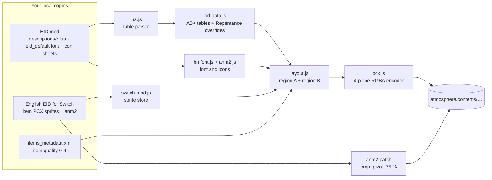
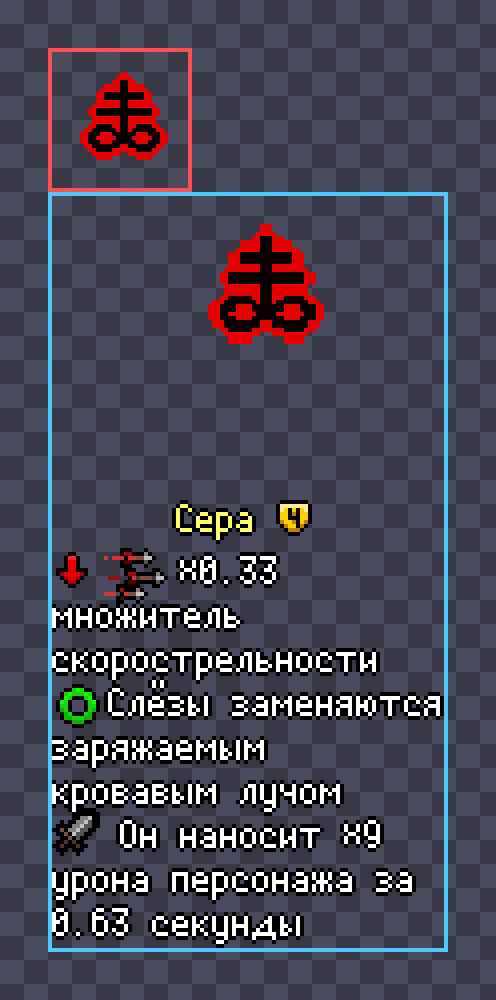
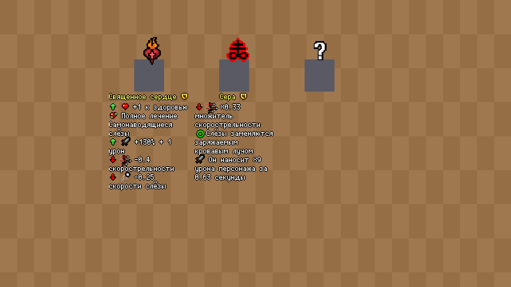

# How it works

This page explains how the mod is built and why each design decision was made. Most of the constraints come from one fact:
**on the Switch you can only replace files, not run code.** Everything EID does at runtime on PC has to be pre-rendered into textures.

- [Pipeline](#pipeline)
- [Constraints of the Switch port](#constraints-of-the-switch-port)
- [Decisions](#decisions)
- [The text engine](#the-text-engine)
- [File formats](#file-formats)
- [Known limitations](#known-limitations)

## Pipeline



`bin/build.js` runs the whole pipeline in about two seconds and writes 913 files:
908 item and trinket sprites, three hidden-item sprites and two patched animation files.

## Constraints of the Switch port

| Fact | Consequence |
|---|---|
| No Lua / mod API | Descriptions must be drawn into the item textures ahead of time |
| Atmosphère LayeredFS replaces files by path | Same file names and folders as the game: `contents/<title id>/romfs/…` |
| Repentance is a DLC of Afterbirth+ (`010021C000B6B001` on top of `010021C000B6A000`) | Sprites live in the DLC romfs, animations in the base game's `rp_patch` folder |
| Textures are PCX, 8 bits × 4 planes (RGBA) | A custom PCX codec (`src/pcx.js`) |
| Item sprites are drawn through `005.100_collectible.anm2` / `005.350_trinket.anm2` | Size, crop, pivot and scale of what is shown can be changed in the anm2 |
| The game console runs Repentance **1.7.9b**, not Repentance+ | EID's Repentance+ overrides must not be applied |

## Decisions

### 1. One animation layer, not two

The obvious design is to add a second anm2 layer for the text, so it can be positioned and scaled independently of the item.
It was tried (v2), and on the console **every item showed the description of _The Sad Onion_** and every trinket the one of *Fish Head*.


The reason is in the game's Lua documentation: `Sprite:ReplaceSpritesheet(LayerId, PngFilename)` works **per layer**.
When the game puts an item on a pedestal it replaces the sheet of the item layer only. A new layer that points to the same
spritesheet id keeps the default sheet from the anm2, and the default collectible sheet is `Collectibles_001_TheSadOnion.png`.

So all text has to live in the item's own layer, inside the item's own texture.

### 2. Region A and region B inside one texture

Other parts of the game use the same item texture and always crop its top-left `32 × 32`:
the active item in the HUD, the item Isaac holds over his head, the collection page.
That corner therefore has to keep the original artwork. The texture is split in two regions:



- **Region A**, `(0,0)–(35,35)`, in red: the untouched artwork. 36 px rather than 32, because 71 item sprites have a 1–2 px outline outside the 32 × 32 box;
- **Region B**, from `y = 36`, in blue: a copy of the artwork **upscaled by 4/3** and centred, with the name, quality badge and description under it.

The patched anm2 shows only region B in the `Idle` (pedestal) and `ShopIdle` animations. It crops from `y = 36`, moves the pivot under the copied art and scales by 75 %.
The pickup animations crop only region A, so a picked-up item looks vanilla.

<br clear="right">

### 3. Why 75 % and 4/3

The Switch Lite shows the game's 480 × 270 frame on a 1280 × 720 panel, a factor of **2.667**, which is not an integer.
Text drawn at 100 % gets uneven 2- and 3-pixel-wide strokes and looks large.
At **75 %** the factor becomes `2.667 × 0.75 = 2.0`, so every font pixel is exactly 2 × 2 screen pixels: smaller and perfectly crisp.
The item art in region B is pre-scaled by `4/3`, so after the 75 % scale it ends up at its original size.

### 4. Block width and offsets

Shop items and devil deals stand about 80 game pixels apart. Region B is **100 px wide**, so it takes 75 px on screen and leaves a gap between neighbours.
The first text line starts 33 image px (≈ 25 game px) below the art for items, which clears pedestal altars and shop price tags,
and 36 px for trinkets, whose price tag sits closer.



`npm run preview -- --scene shop|pedestal` renders these simulations straight at screen resolution, the way the console scales sprites.

### 5. Hidden items

Curse of the Blind and hidden pedestals swap the item texture to `gfx/items/collectibles/questionmark.png`, a vanilla 32 × 32 image.
With the patched anm2 cropping region B, a vanilla "?" would be invisible. The build therefore writes its own `questionmark.pcx`
(a hand-drawn "?" in both regions, no text) to every path the game may load it from.

### 6. Which descriptions

EID keeps base descriptions for Afterbirth+ (`descriptions/ab+/<lang>.lua`), overrides for Repentance (`descriptions/rep/…`) and for Repentance+ (`descriptions/rep+/…`).
The console runs Repentance, so the builder applies `ab+` then `rep`, never `rep+`. That matters because Repentance+ rebalanced more than 60 items.
Two Russian descriptions mention PC keys (Ctrl) and are reworded for the console in `src/overrides.ru.json`.
Missing translations fall back to English per item (0 with EID 5.23).

## The text engine

To look exactly like EID, the engine re-implements EID's own rendering rules instead of drawing text with a system font:

- **Font:** `eid_default.fnt`, a binary BMFont v3 built from PixelMplus10 with a 1 px outline. The outline lives in the alpha channel and the glyph in RGB, so tinting RGB colours the letters and keeps a black outline (`src/bmfont.js`). It contains Latin and Cyrillic.
- **Markup:** EID's shortcuts (`↑` → `{{ArrowUp}}`, `!!!` → `{{Warning}}`, …), `{{Icon}}` tokens and colour tags that are ignored (`src/markup.js`).
- **Icons:** read from `EID.InlineIcons` in `features/eid_data.lua` (animation, frame, width, offsets) and drawn from EID's `.anm2` icon sheets. `{{CollectibleN}}` draws the item's own art at 50 %, like EID's `ItemIcon`.
- **Data:** descriptions are read with a small Lua table-constructor parser (`src/lua.js`), so no Lua runtime is needed.

`npm run calibrate` proves the engine by re-rendering the **English** text in the **original** mod's layout and diffing the result against its sprites:

```text
wrap width 165px reproduces the height of 898/908 reference sprites (layout uses 165px)
col105 The D6                 0 / 1346 pixels differ  (pixel-exact)
col118 Brimstone           1019 / 4367 pixels differ  (icon artwork differs between EID versions)
```

Text-only sprites match pixel for pixel. Sprites with icons differ only because the original mod used older EID icon artwork.

## File formats

**PCX** (`src/pcx.js`): 128-byte header, `bpp = 8`, `planes = 4`, `bytesPerLine = width` rounded up to even.
Each scanline stores R, G, B and A planes one after another, RLE-compressed (`0xC0 | count`, value). Runs never cross a plane boundary.
The header of the original sprite is reused, so unrelated fields (DPI, palette info) match the game's files.

**anm2**: XML. The patch only rewrites attributes of the item layer's `<Frame>` elements:

| Animation | Change |
|---|---|
| `Idle`, `ShopIdle` | `XCrop=0 YCrop=36 Width=100 Height=<tallest sprite>`, `XPivot=50`, `YPivot=round(pivot × 4/3)`, scales × 0.75 (bobbing preserved) |
| `PlayerPickup`, `PlayerPickupSparkle` | crop `36 × 36` (region A only) |
| trinket `Appear` | blank crop moved from `(64,32)` to `(40,0)`, which is always empty in this layout |

## Known limitations

- **No awareness of the player.** Textures cannot show text only for the nearest item, so every description is visible. Very long ones (for example *Mr. Me!* or *Pandora's Box*) can reach the bottom wall.
- **Text bobs** with the item in the pedestal animation, because it is part of the same layer.
- **US title IDs** only. Other regions use different `contents/<title id>` folders.
- **Translation quality** is EID's. Run the build again after EID updates to pick up new translations.
